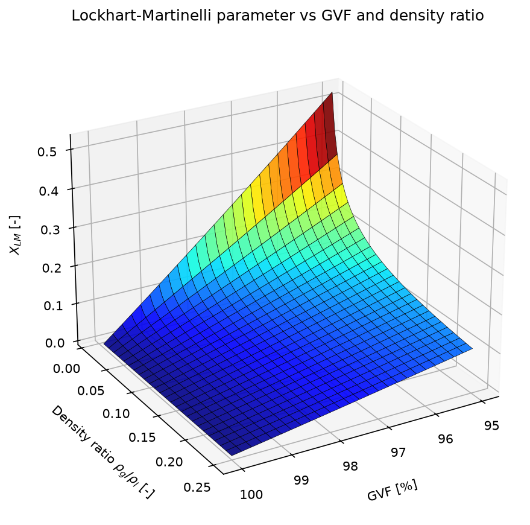
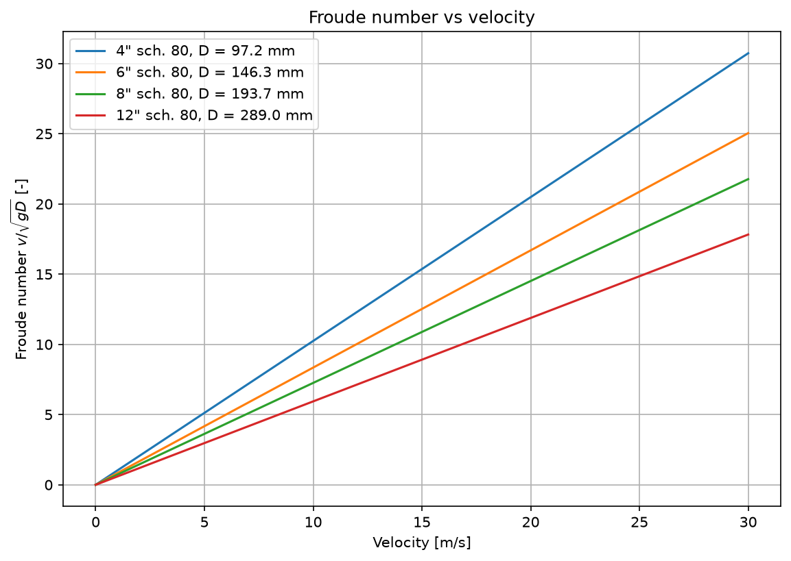
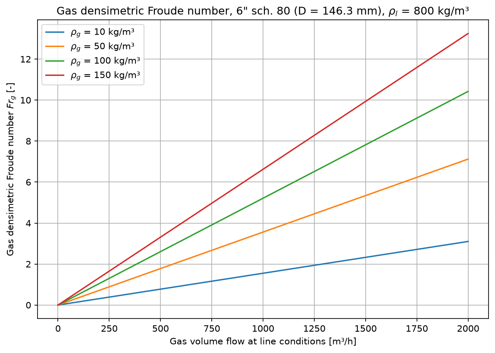

# Lockhart-Martinelli and Froude Numbers

Shows how the Lockhart-Martinelli parameter depends on the gas volume fraction (GVF)
and the gas-to-liquid density ratio, and how the Froude number and the gas
densimetric Froude number depend on velocity and gas volume flow.

All input values are illustrative. Pipe inner diameters are schedule 80, calculated
from the outside diameter and wall thickness tabulated in
[Nominal Pipe Size](https://en.wikipedia.org/wiki/Nominal_Pipe_Size).

**Required packages**: pvtlib, numpy, matplotlib

## Usage

```sh
python lockhart_martinelli_and_froude_numbers.py
```

The plots are saved as PNG files in this folder.

## Lockhart-Martinelli parameter vs GVF and density ratio

GVF from 95 % to 100 %. The density ratio covers gas densities of 10-150 kg/m³ and
liquid densities of 600-1000 kg/m³, i.e. from 10/1000 = 0.01 to 150/600 = 0.25.
For a given GVF, the Lockhart-Martinelli parameter depends only on the density ratio.



## Froude number vs velocity

Froude number `v/sqrt(g D)` for 4", 6", 8" and 12" pipes.



## Gas densimetric Froude number vs gas volume flow

Gas densimetric Froude number in a 6" pipe for gas densities of 10, 50, 100 and
150 kg/m³, with a liquid density of 800 kg/m³. The gas volume flow is at line
conditions.


